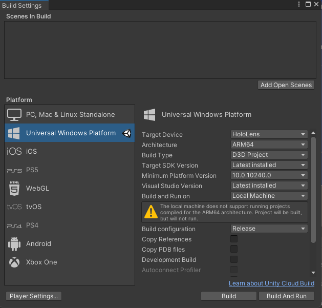
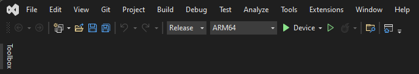
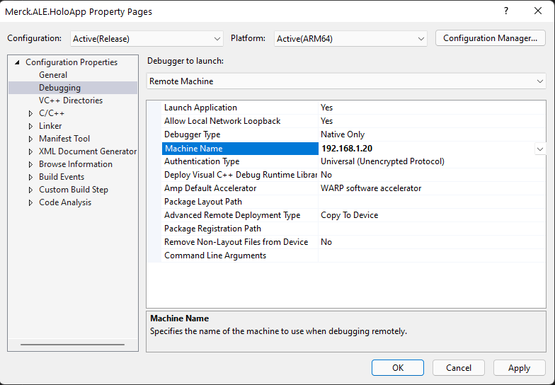

# HoloLens Application - Merck Lab Assistant

This is the HoloLens Application used in the Merck AI Lab Engine project.

## Setup

Make sure you have setup your development machine with the required software as described in the [Getting Started documentation](..\..\docs\getting-started\readme.md).
When you retrieve this project for the first time from the repo, set it up with these steps:

1. Open the project with **Unity 2020.3.33f1 (LTS)**

   > [!NOTE]
   >
   > You might get errors on first time load where Unity suggests to open in Safe Mode. **Ignore that message** and press **Continue**. You need to switch the platform (explained below) for NuGet to kick in and download the Merck.Ale.Domain library. Then it will compile.
2. In the Build Settings (menu open File > Build Settings ...)
3. Under Platform select **Universal Windows Platform**
4. Use the settings as shown in the image below:

5. Click **Switch Platform**
6. In the **Project** pane under **Assets\Scenes** double click **Main** to open the main scene.

## Configure

Create the file **Assets\StreamingAssets\Resources\appsettings.json**. for details about this file, see [Configure the HoloLens Application](./docs/configure.md). If you haven't set these secrets, the `ApplicationManager` will show an error that configuration is required. Also the authentication and calling into the backend won't work because of this.

## Build

To build the application, execute the **Build** in the Build Settings dialog. A folder picker dialog will open. Create a **Build** folder or select the existing one. After the build is done, a Windows Explorer window will open in the Build folder.

A Visual Studio solution is generated from the Unity project. Open the solution (.sln) with Visual Studio. In the top menu bar of Visual Studio select **Release** and **ARM64** for HoloLens deployment.



You can deploy to **Device** when attached to USB or to **Remote** over WIFI. If you want to deploy over WIFI, make sure you have set up the **Machine Name** in the Debugging settings. Right-click the (Universal Windows) project and click **Properties**. Under *Configuration Properties* select **Debugging**. When **Remote Machine** is selected under *Debugger to launch* you'll see this UI. Put the IP address of your HoloLens in the **Machine Name**.



For more information (including setting up your HoloLens for side loading) see [Using Visual Studio to deploy and debug - Mixed Reality | Microsoft Docs](https://docs.microsoft.com/en-us/windows/mixed-reality/develop/advanced-concepts/using-visual-studio?tabs=hl2)

## Security Configuration

The redirect url that must be registered for the LabAssistant.HoloApp in the client app registration is: **ms-appx-web://microsoft.aad.brokerplugin/S-1-15-2-1369400529-3688795706-185729123-57922394-1228485375-1599191277-1070913205** (10-8-2022).

## Patch MRTK Foundation Package

Because of conflicting namespaces of UnityEngine.Graphics and Microsoft.Graphics, we decided to patch the included MRTK package to use to correct full-qualified namespace to solve those issues. For this purpose we extracted **Packages\MixedReality\com.microsoft.mixedreality.toolkit.foundation-2.7.3.tgz** in our repo (using Windows Subsystem for Linux):

```bash
tar -xvzf com.microsoft.mixedreality.toolkit.foundation-2.7.3.tgz
```

The contents is unpacked in the **./package** folder. Then we made these code changes:

* Core\Utilities\Lines\Renderers\MeshLineRenderer.cs

  * Line 150: Change **Graphics.** to **UnityEngine.Graphics**

* SDK\Features\UX\Scripts\Pointers\SpherePointerGrabPoint.cs

  * Line 44: Change **Graphics.** to **UnityEngine.Graphics**

* Services\DiagnosticsSystem\MixedRealityToolkitVisualProfiler.cs

  * Line 396: Change **Graphics.** to **UnityEngine.Graphics
  * Line 404: Change **Graphics.** to **UnityEngine.Graphics**

After these changes, we deleted the existing package and re-packaged the changed ./package folder to the foundation package with this command (using Windows Subsystem for Linux):

```bash
tar -cvzf com.microsoft.mixedreality.toolkit.foundation-2.7.3.tgz package
```

After this is done, the ./package folder should be deleted and not be part of the repo!
