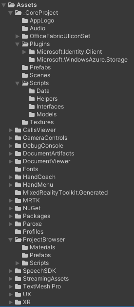
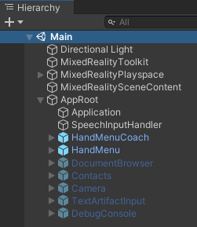
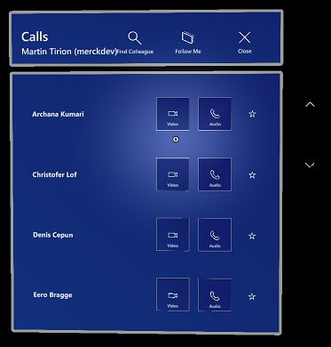
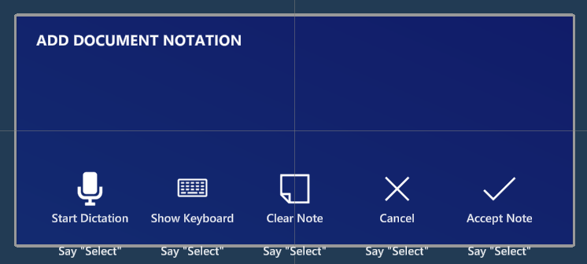

# Architecture of Merck.Ale.HoloApp

This document describes the folders and files you can find in the Projects panel. It also describes the architecture used in the main scene of the application.

## Project structure

When you open the **Merck.Ale.HoloApp** application in Unity, you see this structure in the **Project** panel:

> [!NOTE]
>
> We have tried to keep the structure consistent, but some structures were a result of a first setup by multiple people at the beginning of the project. Where it was possible we have tried to align them to the same structure. But sometimes it was too much work and had too much impact to the project timelines, that we decided to leave it in it's place. We'll highlight these in this document as well.

### Core Project

The main application logic is located in the **Assets/_CoreProject** hierarchy. A few things to hightlight:

| Folder or file  | Purpose                                                      |
| --------------- | ------------------------------------------------------------ |
| Scenes\Main     | This is the main scene (and only scene) of the application.  |
| Scripts         | All the main logic scripts of the application. The main **ApplicationManager** script can be found here, that's controlling the overall application logic. |
| Scripts\Models  | General model classes                                        |
| Scripts\Data    | Vairous separate scripts that actually make up the same **AleClient** class for accessing the Merck Ale Backend API. All classes in this folder are marked as *partial* to have the compiler combine them to 1 class on build. The **AleClient** script is the main logic of the class, where for instance **AleClient-Contacts** has the specific methods for accessing the API calls specific to contacts. |
| Scripts\Helpers | These are helper classes for providing specific functionality throughout the app and scripts. |
| Plugins         | Here you can find binary libraries we added manually to the project and stored in the repository. Currently Microsoft Authentication Library (MSAL) and the Azure Blob Storage client SDK. You will also find link.xml files here to make sure the libraries are not stripped by Unity. |
| AppLogo         | This contains all the PNG's used for the various variations of the application logo |

### Components

You can find various components of the application in the **Assets** folder, that each have their own folders for scripts, prefabs and others. Below a list of the components of this application. We'll provide a link for every component to the more detailed documentation for each component.

Eeach component has it's own structure to store various parts. Mostly there is a **Scripts** folder containing the code and a **Prefabs** folder containing sub-parts and/or the main prefab for the component.

| Component                                                | Purpose                                                      |
| -------------------------------------------------------- | ------------------------------------------------------------ |
| [Main Application](./components/application.md)          | This is the main application manager. This is used only once in the hierarchy. To see how this is setup, see the referenced documentation. |
| [DocumentBrowser](./components/document-browser.md)      | This is the main selection dialog of the application to select the project, lab session and document. The main prefab to use is **ProjectBrowser\Prefabs\DocumentBrowser**. Note that this part is sometimes referenced as project browser, sometimes as document browser. |
| [DocumentViewer](./components/document-viewer.md)        | This is the main prefab for showing all documents in the application. The HoloLens application only displays PDF documents using this prefab. The main prefab that is used is **DocumentViewer\Prefabs\DocumentViewer**. |
| [DocumentArtifacts](./components/document-artifacts.md)  | Artifacts are related to documents and can be text notes, photo's or video's. The main prefab for showing the list is **DocumentArtifacts\prefabs\DocumentsArtifactsPanel**. |
| [CameraControls](./components/camera.md)                 | The camera control is used to take a picture or record a video. The main prefab is **CameraControls\prefabs\Camera**. |
| [TextArtifactInput](./components/text-artifact-input.md) | The text artifact input componentis part of the Document Artifacts and used to take notes with speech or keyboard. The main prefab is **DocumentArtifacts\prefabs\TextArtifactInput**. |
| [ShowImage](./components/show-image.md)                  | The show image component is part of the Document Artifacts and is used to show an image of an existing artifact. The main prefab is **DocumentArtifacts\prefabs\ShowImage**. |
| [CallsViewer](./components/contacts.md)                  | This is a selection dialog for starting an audio- or video-call to a colleague. The main prefab is **CallsViewer\prefabs\Contacts**. |
| [HandMenu](./components/hand-menu.md)                    | This is the main menu that is shown next to your hand palm. With this menu you can open the ProjectBrowser or Contact selection. The main prefab is **HandMenu\prefabs\HandMenu** |
| [HandCoach](./components/hand-menu.md)                   | This is the coach that is shown on startup after some timeout. It shows the user how to rotate a hand to show the main menu. Once the menu is visible, the hand coach is disabled. The main prefab is **HandCoach\prefabs\HandMenuCoach**. |
| [DebugConsole](./components/debug-console.md)            | This is just used for development purposes. Some messages are written to this debug console. When made visible, the messages can be inspected. Especially useful for understanding what's happening on the HoloLens without a debug session. The main prefab is **DebugConsole\prefabs\DebugConsole**. |

### Other folders

Some other folders need explanation.

| Folder                                     | Purpose                                                      |
| ------------------------------------------ | ------------------------------------------------------------ |
| Fonts                                      | Custom fonts used in the application. We tried to standardize on Segoe MDL2 SDK font. |
| MixedRealityToolKit.Generated, MRTK and XR | Some MRTK specific folders generated by MRTK.                |
| NuGet and Packages                         | NuGet package manager. The installed nuget packages are stored in the Packages folder. We only use it now for the Merck.Ale.Domain class library to share models between the server and the client. |
| Paroxe                                     | This is a licensed component for showing PDF's on the HoloLens. Licenses are linked to develop accounts. This component cannot be reused without buying a new license. |
| Profiles                                   | MRTK profiles                                                |
| SpeechSDK                                  | The Azure Cognitive Speech SDK                               |
| StreamingAssets                            | The place where the application looks through Unity API's for the application settings. |
| TextMesh Pro                               | This is needed for showing crisp text in Unity. Added by MRTK. |
| UX                                         | These are some left overs from the beginning of the project. Also some basic UX components that are used in the application. Do not move or change without knowing the consequences! |

## Main Scene

The main scene can be found in **Assets\\_CoreProject\Scenes\Main**. The hierarchy of the main scene looks like this:

The first four game objects (Directional Light, MixedReality Toolkit, MixedRealityPlaspace and MixedRealityScenContent) are default additions when MRTK is enabled in a scene. The main logic and UI elements can be found under the game object **AppRoot**.

### Application

The **Application** game object is the main application logic. This is implemented in the `ApplicationManager` script which handles application startup, reading application settings and retrieving the access token for the current user for accessing the backend API. The `AleClient` script is also added to this game object for global use through the `ApplicationManager`. For more information on how this is configured or how to use it, see [Use Authentication in the HoloLens Application](use-auth-in-hololens-app.md).

More details on the main Application component and it's scripts can be found in [Main Application](./components/application.md).

### Speech Input Handler

This game object just has the `SpeechInputHandler` script attached to it. Global speech commands are defined here. At this moment two are implemented:

* **"Show Documents"** will show the Document Browser.
* **"Show calls"** will show the Contacts list to start a call.

### Hand menu and coach

The **HandMenu** and **HandMenuCoach** game objects are for the main hand menu when the application starts.

The `HandMenuCoach` is triggered after a few seconds automatically to show the user what to do (in case he/she doesn't know) to bring up the hand menu.

The hand menu is the main entry point for accessing the *Project browser* or to *call a colleague*. During development two extra options are available: show the Debug Console and show/hide the MRTK Profiler.

When the hand menu is triggered, the menu is shown and the hand coach is disabled. This is done in the `OnHandActivate` definition of the `HandConstraintPalmUp` script.

### Project browser (or Document browser)

The **DocumentBrowser** game object is the main UI element for showing and selecting projects, lab sessions and it's documents.

In the left hand list all projects are shown visible for the user. When a project is selected, the lab sessions for that project is shown. After selecting a lab session, the available documents are shown for that lab session. By clicking the document a *Document Viewer* is launched for the document.

When the Project Browser is shown for the first time, a pre selection is made for the user. The first Lab Session for today or in the future is selected. If there isn't such a lab session available, then the last one (in time) is selected. If the user correctly set the lab visit date for a lab session, then it will automatically open on that day so the user can get started. Of course he/she can still select other lab sessions and projects if needed.

### Contacts

The **Contacts** game object is the contact selection list that is shown when the *Calls* menu entry is selected on the hand menu.

The list of users is coming from SharePoint. For every contact there is the option to start an audio-call or a video-call. Once this is clicked the application will launch the Dynamics 365 Remote Assist application to make the call.

### DebugConsole

The **DebugConsole** game object is only used in the development process. It shows a console with debug messages from the application. There is also a button to clear the contents. The dialog can be opened from the hand menu using the *Debug* menu choice.

### Camera

The **Camera** game object contains the logic for taking pictures and record a video. There is only one instance, as we can claim the use of the real camera on the HoloLens only once at the same time. The camera is launched from a *Document Viewer* when the take picture or record video button is clicked. When the user clicks save to store the picture or video, it is linked to the document that started the use of the camera and the page of the document that is visible.

### TextArtifactInput

The **TextArtifactInput** game object contains the logic for taking notes. This can be done by dictation (speech) or typing on a virtual keyboard. Once the user clicks on *Accept Note*, the content is written to the backend and attached to the document that started the dialog and the page of the document that is visible.

