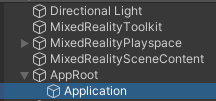
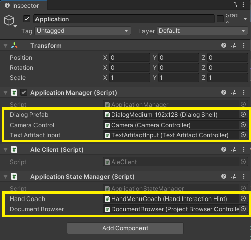

# Main Application

To setup the main application create the basic *game objects* in the hierarchy. Create `AppRoot` in the top of the hierarchy and `Application` as a child. Attach the `_CoreProject\Scripts\ApplicationManager.cs` script to the `Application` game object.  The `AleClient` and `ApplicationStateManager` classes will be added automatically as well. 

Now the main Application Manager is added to the scene, we also need to configure it. The `ApplicationManager` requires these fields:

* **Dialog Prefab** - Assign the `DialogMedium_192x128` dialog prefab from MRTK to this field. It is used throughout the app as standard message popup dialog.
* **Camera Control** - Assign the **Camera** game object from the hierarchy for taking pictures and recording videos.
* **Text Artifact Input** - Assign the **TextArtifactInput** game object from the hierarchy for adding text notes.

The `ApplicationStateManager` requires these fields:

* **Hand Coach** - Assign the **HandMenuCoach** game object from the hierarchy so state management can disable it when restoring state.
* **Document Browser** - Assign the **DocumentBrowser** from the hierarchy so state management can show it and/or spawn documents from it when restoring state.

> [!NOTE]
>
> For local development, make sure to add the **appsettings.json** file to **Assets/StreamingAssets/Resources** folder. For more details, see the [main README](../../README.md). If you don't do this, an error message is displayed in the UI.

## Application Manager

The `ApplicationManager` is responsible for the main security handling for the logged in user. When the `Application Manager` is loaded, it will do main things:

1. Read the settings from **Assets/StreamingAssets/Resources/appsettings.json**.
   They are available on the **Application** object with the **Settings** field.
2. Get an *access token* for the logged in user (or through code flow in the Unity Editor) using the configuration from **Settings**. The access token is available from the **Application** object through the **GetAccessTokenAsync** method.
3. See if there is state stored on disc. If that's the case the `ApplicationStoreManager` will take care of restoring it in the UI.

The `ApplicationManager` has an `IsInitialized` field that can be read to see if the previous steps were fully executed and successful. You can also register to the `Initialized` event to be trigged once the initialization is done.

You can get to the `ApplicationManager` through the static field `Instance` on the class. To do this, use this C# code:

```csharp
ApplicationManager app = ApplicationManager.Instance;
```

### Local cache state

The application uses the `LocalCacheState` helper class for the local cache. The cache is initialized for the logged in user, using the user's unique id. The ID is stored in the local cache folder in the file **cache.id**. If the ID's differ (which means the cache belongs to the previous user, we'll clear the cache).

In the local cache the `AleClient` will also store cached data when it's added to the internal structure for fast restore of state on application switch. Data is stored in the file **projects.json**.

Downloaded documents (PDF) are stored in the local cache folder as well, in the subfolder **documents**.

## Ale Client

The `AleClient` contains scripts to access the **Ale Backend API**. It depends on the `ApplicationManager`. The `InitializeAsync` method of `AleClient` is called in the initialization of the `Application Manager`, which will:

1. Retrieve **all projects and it's lab sessions** for the logged in user from the backend API. This hierarchy is accessible through the **Projects** field, but it's better to use the methods like **GetProjectsHierarchyAsync**.

   > [!NOTE]
   > Most methods will use the cached data if it's there, otherwise it will read from the backend. Some methods can be forced to read from the backend. Some methods always read from the backend. See the documentation of the methods to learn more.

## Application State Manager

The `ApplicationStateManager` is responsible for saving and restoring state in the local cache. This class captures the Unity method `OnApplicationFocus()`. This is the best place to get triggered when focus moves away from this application. See [Unity - Scripting API: MonoBehaviour.OnApplicationFocus(bool) (unity3d.com)](https://docs.unity3d.com/ScriptReference/MonoBehaviour.OnApplicationFocus.html).

When the `OnApplicationFocus()` method is called with focus = false (losing focus), we're saving the UI state in the local cache folder as **ui-state.json**.

When the `ApplicationManager` starts, it looks for the existence of ui-state.json. If it does, it will read data from the local cache and restore the UI state from ui-state.json. After that the ui-state.json is deleted.
