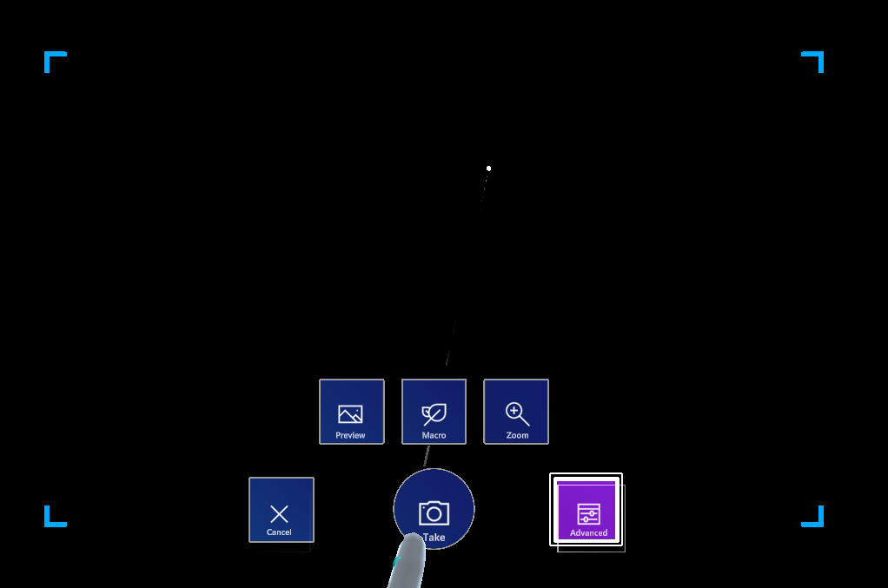

# Camera

This is the camera component for taking pictures and recording videos.



This controls uses the physical camera on the HoloLens to take the pictures, so there can be only 1 instance at the time active. That's why you should use only one instance of this component in a scene.

To use this control, drag the **prefabs\Camera** prefab into the hierarchy and you're done.

## Starting the camera

To start the camera, C# code is needed. First a class must be created that implements the `IArtifactStorageHandler` interface. See [Document Artifacts](document-artifacts.md) for more details on the interface. This interface is called by the camera control to save a file for a picture or recorded video.

To start the camera control you have to call the `ShowCameraUI()` method. You can start the camera in picture mode or in video mode. In the code below (coming from `ArtifactSpawnManager` class) you see that the `ApplicationManager` class (in the `_app` variable) references the Camera game object in the hierarchy. The `_controller` in this case is the `ArtifactsController` that implements the `IArtifactStorageHandler` interface. For more information on this interface, see [Document Artifacts - IArtifactStorageHandler](document-artifacts.md#IArtifactStorageHandler).

```csharp
/// <summary>
/// Launch the camera control to take a picture.
/// </summary>
public void TakePicture()
{
    if (_app.CameraControl != null)
    {
        _app.CameraControl.ShowCameraUI(_controller, true);
    }
}

/// <summary>
/// Launch the camera control to record a video.
/// </summary>
public void RecordVideo()
{
    if (_app.CameraControl != null)
    {
        _app.CameraControl.ShowCameraUI(_controller, false);
    }
}
```

Once the user has taken a picture or recorded a video, a camera UI is shown to select to cancel or to save it. If save is selected, the `CreateFileArtifactAsync()` method is called on the `IArtifactStorageHandler` interface to save the file.  The parameters tell you if it is a picture or a video and what the name of the file is.

## Location of the files

The `CameraControl` is a UWP library. Saved pictures are stored in the **Pictures** folder for the logged in user. Saved video recordings are stored in the **Videos** folder for the logged in user. As UWP doesn't work with file paths but with `StorageFile` and `StorageFolder`, the control hides this implementation for you. To get the file from the user's location a method `ReadFile()` is provided on the `CameraManager` class. You give it the filename and it will return the file as a `byte[]`. Below the code from `ImageArtifactShowController` to load the file and show it with the **ShowPicture** prefab.

```csharp
byte[] image = CameraManager.Instance.ReadFile(filePath);
if (image.Length == 0) return;

//create a texture and load byte array to it
Texture2D sampleTexture = new Texture2D(2, 2);
// the size of the texture will be replaced by image size
bool isLoaded = sampleTexture.LoadImage(image);

// apply this texure as per requirement on image or material
if (isLoaded)
{
    imageRenderer.material.mainTexture = sampleTexture;
}
```

## Play recorded video

Playing a recorded video can be done by the `CameraManager` as well. Below the code from the `ArtifactSpawnManager`:

```csharp
CameraManager.Instance.LaunchFile(artifact.filename);
```

The code will launch the default video player in the HoloLens to play the file on disc if it is available.
