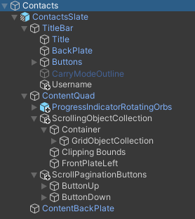
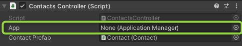

# Contacts

The `Contacts` prefab is the UI to show user's contacts based on `/contacts` API endpoint.

To use it

* drag and drop **Assets/CallsViewer/Prefabs/Contacts** prefab to the scene
* assign "App" game object to the "Contacts" game object

  

## Contacts Prefab Logic

* `ContactsController` script is attached to `Contacts` prefab.
* `ApplicationManager` must be assigned to `Contacts` game object

## Contact Prefab Logic

* `Contact` script is attached to `Contact` prefab.
* Once `Contact` object is instantiated, `Initialize` method must be called to set `Contact` object.
