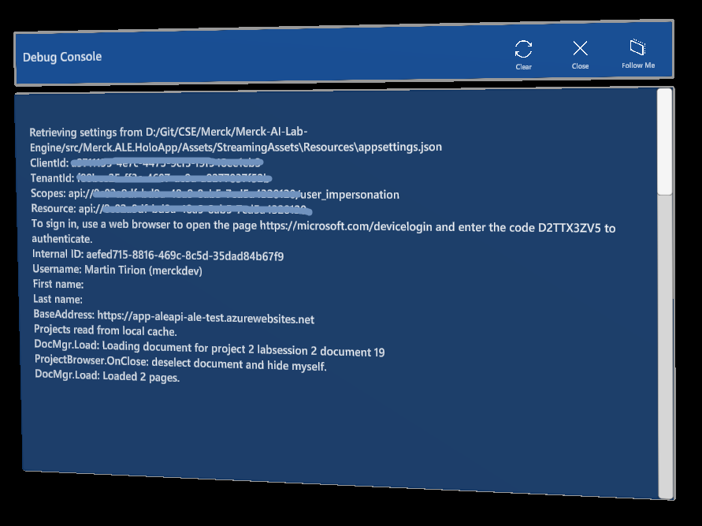

# Debug Console

The debug console is a simple dialog with a scrolling text. It shows all logs send through `Debug.Log()` in Unity and such methods. The prefabs has a configuration if you want data to be added to the list when it's active or always.

At the top is a button to clear the contents.

To use this prefab just drag the **DebugConsole\prefabs\DebugConsole** somewhere in the hierarchy. By default though, the dialog will pick up all Log, Error and Exception messages that can be done using `Debug.Log` and other Unity methods.

The prefab has a `DebugConsoleController` script. That script has the `WriteMessage()` method to add custom text to the dialog. The method has an optional `add` parameter. If you set that to `false` it will clear the contents of the dialog with the provided text, otherwise it will be added to what's there already.
