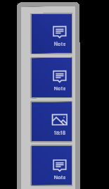

# Document Artifacts

Document Artifacts cover the text notes, pictures and recorded videos that can be attached to a document. There are three main prefabs:

* **prefabs\DocumentArtifactsPanel** handles the list of artifacts.
* **prefabs\ShowImage** is used to show an existing picture artifact.
* **prefabs\TextArtifactInput** is used to input a text note with speech or keyboard.

In this document we'll focus on the Documents Artifacts Panel and the `IArtifactStorageHandler` interface. In seperate documents you can find information on the [Show Image](show-image.md) and the [Text Artifact Input](text-artifact-input.md) components.

## Document Artifacts Panel

The document artifacts panel shows the list of artifacts for a document or a page in a document.



You can just drag the **prefabs\DocumentArtifactsPanel** prefab to a place you want to use it in the hierarchy. It's already used in the Document Viewer. Inside the prefab you can see a pretty standard hierarchy with logic to scroll and layout items. On the **DocumentArtifactsPanel - ScrollingObjectCollection - Container - GridObjectCollection** game object the script `ArtifactsLayout` is added. That artifact has one field that must be set: the `ArtifactPrefab` that is used for each button in the list. The script works with the [Data binding](..\patterns\data-binding-architecture.md) pattern and will look up the hierarchy for an `ArtifactsController`.

You can see how the panel is used in the **DocumentViewer** prefab. On the DocumentViewer level the scripts `ArtifactsController` and `ArtifactsSpawnManager` are added. The controller is part of the data binding pattern referenced above. The spawn manager takes care of creating new items and adding it to the document and for showing existing items.

## IArtifactStorageHandler

The `IArtifactStorageHandler` interface is meant to abstract artifact input with the Camera control or the ArtifactTextInput control and saving the data. A controller should implement this interface and the controller is then passed as parameter to the specific control. Once the control has the need to save text or a file, it will call one of the methods of this interface to save it.

### CreateTextArtifactAsync

One method that needs to be implemented is the `CreateTextArtifactAsync()` method. This has the text as parameter and can store it in the context of the data. Below some code from the `ArtifactsController` class with an implementation of this method:

```csharp
/// <summary>
/// Create the text artifact for the given text. Context is selected project,
/// lab session, document and location in this class.
/// </summary>
/// <param name="text">Text to save. Empty text is not saved.</param>
/// <returns>Save successful TRUE/FALSE.</returns>
public async Task<bool> CreateTextArtifactAsync(string text)
{
    if (string.IsNullOrWhiteSpace(text))
    {
        // don't save empty strings.
        return false;
    }

    try
    {
        // add the artifact
        await App.DataClient.CreateArtifactAsync(
            this.projectId, this.labSessionId, this.documentId, this.location,
            ArtifactType.Note, text, null);

        // retrieve up-to-date list of artifacts
        await LoadArtifactsForContextAsync();

        // invoke a change of data
        OnArtifactsUpdated?.Invoke();

        return true;
    }
    catch (Exception ex)
    {
        App.LogError(ex.ToString());
        return false;
    }
}
```

### CreateFileArtifactAsync

The other method that needs to be implemented is the `CreateFileArtifactAsync()` method. This has the indicator if this is a picture or video and the file name to store. Below some code from the `ArtifactsController` class with an implementation of this method. You see that this logic is a bit more complex, where the file is uploaded first. When that is succesfull the artifact is created with the URL where it was stored.

```csharp
/// <summary>
/// Create the file artifact for the given image or video. Context is selected project,
/// lab session, document and location in this class.
/// </summary>
/// <param name="isPicture">Is this a picture (true) or a video (false).</param>
/// <param name="filename">File name.</param>
/// <returns>Save successful TRUE/FALSE.</returns>
public async Task<bool> CreateFileArtifactAsync(bool isPicture, string filename)
{
    if (string.IsNullOrWhiteSpace(filename))
    {
        // don't save empty strings.
        App.Log($"ArtifactController.CreateFile: We don't save empty file name.");
        return false;
    }

    try
    {
        ArtifactUploadInfo info = await App.DataClient.GetArtifactUriAsync();
        if (info == null)
        {
            App.LogError($"ArtifactController.CreateFile ERROR: get URI returned NULL!");
            return false;
        }

        // TODO: this must be moved to a queueing mechanism
#if WINDOWS_UWP
        StorageFolder folder;
        if (isPicture)
        {
            folder = await KnownFolders.GetFolderAsync(KnownFolderId.PicturesLibrary);
        }
        else
        {
            folder = await KnownFolders.GetFolderAsync(KnownFolderId.VideosLibrary);
        }
        StorageFile file = await folder.GetFileAsync(filename);
        using Stream stream = await file.OpenStreamForReadAsync();
        CloudBlockBlob cloudBlockBlob = new CloudBlockBlob(new Uri(info.ArtifactUploadUri));
        await cloudBlockBlob.UploadFromStreamAsync(stream);
#endif                

        // add the artifact
        await App.DataClient.CreateArtifactWithIdAsync(
            info.Id, this.projectId, this.labSessionId, this.documentId, this.location,
            (isPicture ? ArtifactType.Image : ArtifactType.Video), null, filename);

        // retrieve up-to-date list of artifacts
        await LoadArtifactsForContextAsync();

        // invoke a change of data
        OnArtifactsUpdated?.Invoke();

        return true;
    }
    catch (Exception ex)
    {
        App.LogError($"ArtifactController.CreateFile ERROR: {ex}");
        return false;
    }
}
```
