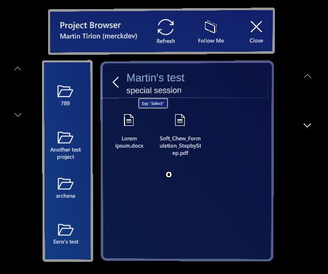
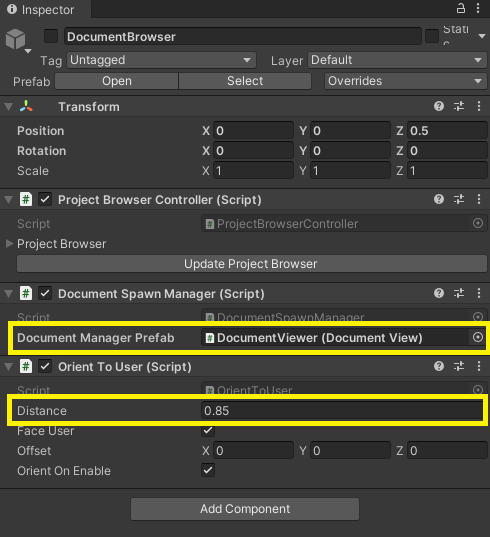

# DocumentBrowser (aka Project Browser)

This is the prefab to show the user the available projects, lab sessions and documents. The browser will spawn a **Document Viewer** to show document contents. All prefabs, materials and scripts for this component can be found in **Assets\ProjectBrowser**.

To use this component, drag the **Prefabs\DocumentBrowser** prefab to the hierarchy. Two things need to be configured.

Assign the **DocumentViewer prefab** to the `DocumentManagerPrefab` field of the `DocumentSpawnManager` script. This prefab is spawned for viewing the document contents of a selected document.

The `OrientToUser` script makes the dialog pop up in front of the user towards him. The distance can be set with the `Distance` field.

## Layout

The layout of the various elements is done using the [Reactive Slate](..\patterns\reactive-slate.md) scripts.

## Architecture

The **DocumentBrowser** uses the [Data Binding Architecture](..\patterns\data-binding-architecture.md) for the list of projects, lab sessions and documents.
