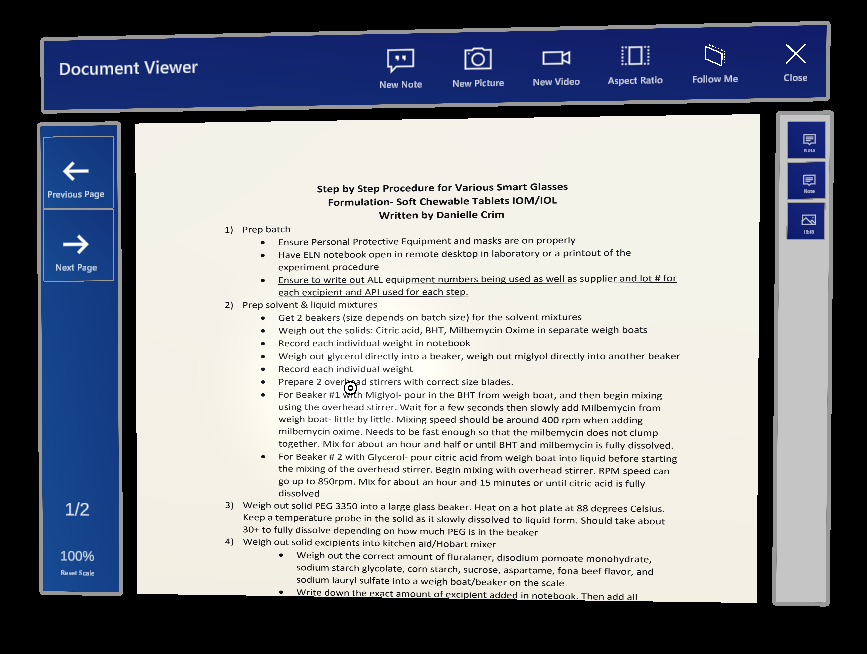
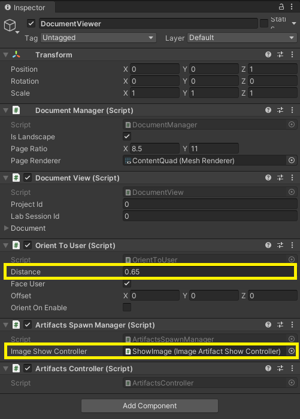

# DocumentViewer

The **document viewer** prefab is used to show a document in PDF format.

This prefab is not used in the hierarchy in the editor, but is spawned from the **DocumentBrowser** when a document is clicked. The logic in the `DocumentSpawnManager` script will instantiate an instance of the DocumentViewer prefab. Once this game object is instantiated, the script will do a few things:

* It uses the `DocumentView` class that contains the data of the game object (and document)
* It will call `UpdateDocument` of the view to set the data for the document (but not the content)
* Next it will tell the `DocumentManager` to load the PDF.

The prefab is completely configured when it was developed with the additional settings from the steps described above. The settings look like this:

The `OrientToUser` script is used to orient the document to the user when spawned. The distance is set with the `Distance` field.

The prefab is assigned that is used to show a selected image next to the dialog. This must implement the `ImageShowController` script.

## Artifacts

On the right hand side of the document, the artifacts list is visible for the active page. The buttons in the title bar can be used to add a text note, picture or video. When you click an existing artifact, it will be shown in the appropriate UI for that type.

The list of artifacts uses the [Data Binding Architecture](..\patterns\data-binding-architecture.md) for the data.
