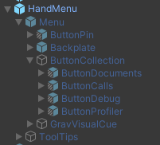
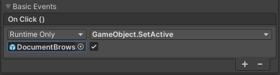
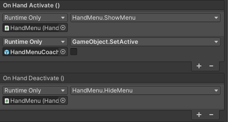

# Hand Menu

The `Hand Menu` prefab is the UI to show menu of application and a hand coach to know how to show the menu. On first load it will also show tooltips for the main menu items that can be executed with voice commands.

To use it, just drag and drop **Assets/HandMenu/Prefabs/HandMenu** prefab to the scene. Next you have to set the `OnClick` events of the buttons in the menu to actually start something.

For the **ButtonDocuments** assign the **DocumentBrowser** game object from the hierarchy as the receiving object. As method select **GameObject.SetActive** with the checkbox checked.

For the **ButtonCalls** assign the **Contacts** game object from the hierarchy as the receiving object. As method select **GameObject.SetActive** with the checkbox checked.

For the **ButtonDebug** assign the **DebugConsole** game object from the hierarchy as the receiving object. As the method select **GameObject.SetActive** with the checkbox checked.

The **ButtonProfiler** is already setup to call the **HandMenu.ToggelProfiler** method.

## Hand Menu Logic

* `HandMenu` script is attached to `Hand Menu` prefab.

* `HandConstraintPalmUp` component of `Hand Menu` object must be set as on picture bellow. On activation it will show the menu (and tooltips the first time) and will hide the **HandMenuCoach**. On deactivation it will hide the menu and tooltips.

  
  
* `Menu` object (child `Hand Menu` object) is created from **Packages/com.microsoft.mixedreality.toolkit.foundation/SDK/Features/UX/Prefabs/Menus/NearMenu3x1** prefab .

## Hand Menu Coach Logic

`Menu Coach` is another prefab: **Assets/HandMenu/Prefabs/HandMenuCoach/HandMenuCoach.prefab**. It is composed of two parts:

* Interaction Hint
* Panel

Interaction hint is MRTK Hand Coach prefab with animation set in **Assets/HandMenu/Animations/HandCoach_L_Animator_HandFlip**
Panel is just text on background with **Assets/HandMenu/Materials/PromptBackground** material.
