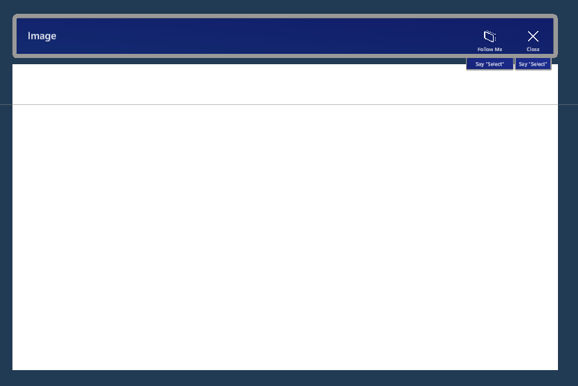

# Show Image

The show image prefab can be used to show an image.



The prefab has the `ImageArtifactShowController` script attached on the highest level. It is configured with a reference to the internal **ImageRenderer**, which is the Quad area (the big white area you see in the image above).

The controller script has a `ShowImage()` method. To launch this prefab with a specific iamge, use some C# code. Below some code from the `ArtifactsSpawnManager` script to show the image of an artifact:

```csharp
if (_imageShowController != null)
{
    _imageShowController.ShowImage(artifact.filename);
}
```

You just provide the file name to show, where the controller uses the `CameraManager` to retrieve the contents of the file and place it as texture on the image renderer.
