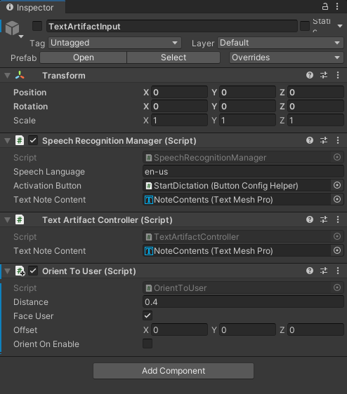

# Text Artifact Input

This is a dialog for text input. It supports the use of speech by using the button **Start Dictation** or by using the keyboard by using the button **Show Keyboard**.


When you start dictation, a listener is started using Azure Cognitive Speech Service. There is an automatic timeout when you stop speaking to have the input processed. The processed text is added to the dialog above. You can use speech and the keyboard interchangeable.

> [!NOTE]
>
> In the current pilot it is not possible to edit the text, just clear the note and start over.

The **prefabs\TextArtifactInput** prefab has the `SpeechRecognitionManager` script attached to the root for the implementation of speech.

The prefab also has the `TextArtifactController` script attached to it for controlling from the outside, but also for saving state. For more information on this interface, see [Document Artifacts - IArtifactStorageHandler](document-artifacts.md#IArtifactStorageHandler).

To use the prefab you can drag it into the hierarchy.



To show the dialog, some C# code is needed. Below code from the `ArtifactSpawnManager` script:

```csharp
/// <summary>
/// Launch the text input dialog to take a note.
/// </summary>
public void TakeNote()
{
    if (_app.TextArtifactInput != null)
    {
        _app.TextArtifactInput.ShowTextInputUI(_controller);
    }
}
```

The `TextArtifactController` script exposes the public method `ShowTextInputUI()`. You have to provide it a class that implements the `IArtifactStorageHandler` interface, so accepted text can be stored. See the description of the use of the interface below.
