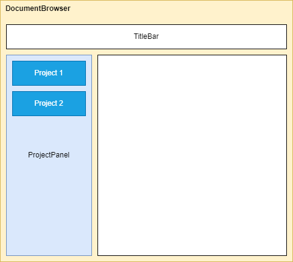
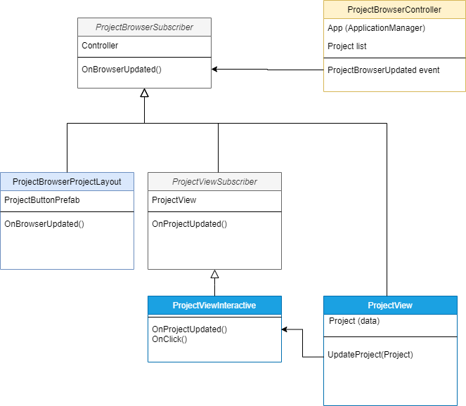
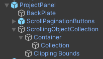

# Data binding architecture

Throughout the application the a similar architecture is used for data binding. Let's have a look at the DocumentBrowser component and how the list of projects is implemented. The main classes are of type *controller*, *layout (list)*, *view* (item) and *interactive* (item).

Below we'll discuss the various parts and their accompanying classes. For reference, the class diagram looks like this. The colors of the classes indicate where it's used in the UI above.

## The controller

The **DocumentBrowser** game object has a `ProjectBrowserController` script. The `ProjectBrowserController` contains the in-memory collection of data and has an event `OnProjectBrowserUpdated` that fires when data is changed in this script.

## The list

The **ProjectPanel** game object contains a **ScrollingObjectCollection** (to enable scrolling through the list) which contains a **Container** game object, which contains a **Collection** game object to layout the items.

The **Collection** game object has two scripts attached to it. The first is a `GridObjectCollection` script (MRTK) to have logic to layout the items and configure it. The other script is `ProjectBrowserProjectLayout`. This script inherits from `ProjectBrowserSubscriber`.

The base-script `ProjectBrowserSubscriber` tries to find the `ProjectBrowserController` script in one of it's parents in the hierarchy when it's enabled. If it's found, the script calls the `OnBrowserUpdated` method (for first loading of the data) and registers to the `OnProjectBrowserUpdated` event of the `ProjectBrowserController` class. The `ProjectBrowserSubscriber` class is marked `abstract` and has an abstract method `OnBrowserUpdated` that must be implemented by all inheriters. This method is then called when the event is fired by the controller.

The `ProjectBrowserProjectLayout` script implements the `OnBrowserUpdated` method. In the implementation the controller is accessed to get the data. Next the logic generates an item (in this case a `ProjectButton`) in the UI for each project. For every button the `ProjectView` class is obtained from the button and the `UpdateProject` method is called. Lastly the `UpdateContent` method is called on the `ScrollingObjectCollection` script (MRTK) to layout the items.

## The item

The **ProjectButton** prefab has two scripts for the logic on it. The view and interaction scripts.

The view script is called `ProjectView`. This script manages changes in the UI of the button, like the name or the used icon. It has a `UpdateProject` method (called when creating the list as we explained above) to update the content of the button and set the data from the `Project` data object coming from the controller. The script also has a public event `OnProjectUpdated` for others to get notifications of UI changes.

The interaction script is called `ProjectViewInteractive`. It inherits from another subscriber class called `ProjectViewSubscriber`. That inherits from `ProjectBrowserSubscriber` we already used above. The `ProjectViewSubscriber` class tries to get the `ProjectView` class on a parent in the hierarchy (so the button itself) and registers to the `OnProjectUpdated` event. When this is fired the abstract method `OnProjectUpdated` is called.

The `ProjectViewInteractive` class implements the `OnProjectUpdated` method. The UI is modified here for the button. In this case just the label of the button (project name). The class also has a public `OnClick` method. When this is called, we set the `SelectedProjectId` in the controller to the id of the selected project button.

To hook up this `OnClick` method with the actual `OnClick` of the button, the `ButtonConfigHelper` script is set. The ProjectButton root game object is assigned to the OnClick object and in the functions list the `ProjectViewInteractive.OnClick` method is assigned.

## Conclusion

The **controller** maintains the data and will let others know when there are changes. The **layout** taks care of adding items to the list in the UI when data changes. The **view** keeps the data for that item. The **interactive** script takes care of what the item looks like in the UI and handles the **click** event.

You can find this architecture and some variations on it throughout the project.
