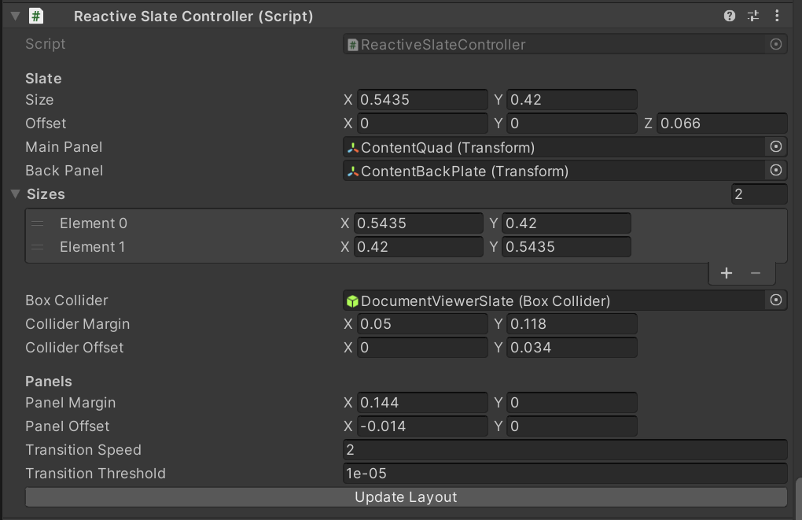
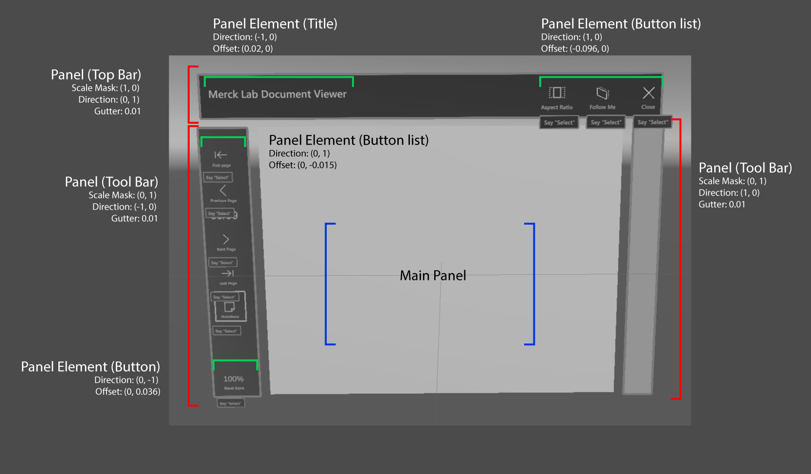
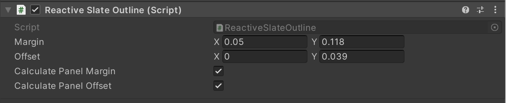
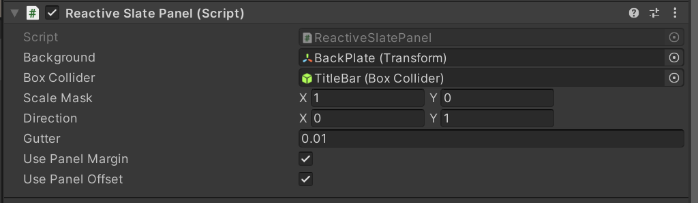
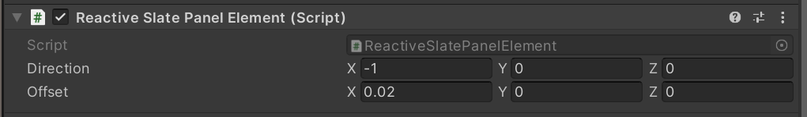
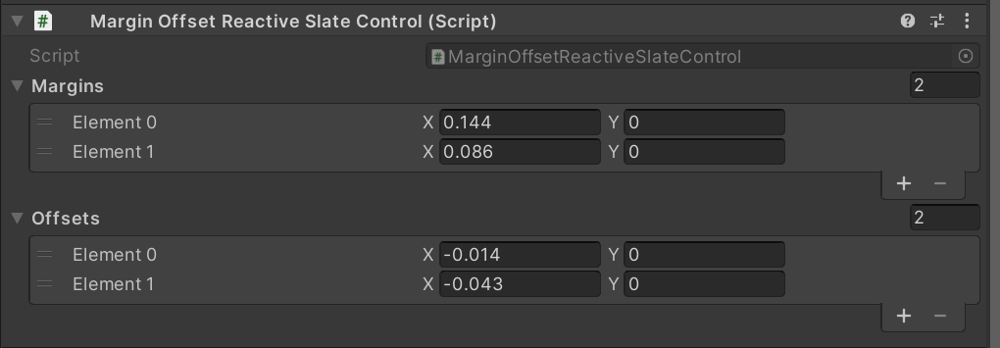

# Reactive Slate

Works with the MRTK Slate control and allows for quick layout changes with responsive UI features.

## Get Started

1. Add a MRTK Slate prefab to your project
2. Add a Reactive Slate Controller to the slate Game Object.
3. Assign desired values
4. Add Reactive Slate Panel components to the Title Bar Game Object
5. Assign desired values
6. Press the Update Layout Button in the Reactive Slate Controller inspector

The Title Bar should adjust size and center on top of the slate.

## Components

### Advanced Features

1. Add panels or breaking up the content area of the slate
2. Automatically update the position of elements within a panel

### Reactive Slate Controller

Provides the main settings for the slate like size and offset values for the Main Panel.

|Property/Method | Description |
|----------------|-------------|
|Slate Inspector Properties | |
| Size  | (Public) The current size of the Main Panel of the Slate |
| Offset | (Read Only) Offset the Main Panel from (0,0,0) |
| Main Panel | (Private) Quad (3D object) that acts as a the primary content area |
| Back Panel | (Private) Similar to main panel but faces the back |
| Sizes | (private) An array of sizes the can be toggled to change the size and layout of the Slate  |
| Box Collider  | (Private) Reference to the Box Collider that will encompass the entire Slate  |
| Collider Margin  | (Private) Padding for the Box Collider, beyond the size of the slate  |
| Collider Offset  | (Private) Move the Box Collider center from (0,0,0) added to calculated position  |
| Panels Inspector Properties |   |
| Panel Margin  | (Public) Total sizeof panels added to the slate, + gutter values (See Reactive Slate Panel)  |
| Panel Offset  | (Public) Compensation for different sized panels, used to center tool bar or other panels  |
| Transition Speed | (Read Only) Speed to transition between sizes, 0 = no transition  |
| Transition Threshold  | (Read Only) Difference between current size and target size before transition animation stops  |
| Editor Controls | |
| Update Layout  | Button to apply settings and invoke OnSlateSizeChanged event for testing in Editor  |
| Events  |   |
| OnSlateSizeChanged | Slate control has changed sizes  |
| Public Fields | |
| Center | Sum of center plus offset |
| Public Methods  |   |
| ToggleSize  | Iterate through the sizes array  |
| SetSizeByIndex(int index)  | Sets a size from the size array  |
| UpdateSlateSize()  | Updates the size of the slate and invokes the OnSlateSizeChanged event  |

### Reactive Slate Subscriber

Base abstract class for building components that react to the Reactive Slate Controller size change event.

Examples of Reactive Slate features and settings.

### Reactive Slate Outline

Scales and positions the carry/follow me outline of the slate

|Property/Method | Description |
|----------------|-------------|
| Inspector Properties | |
| Margin | (private) Padding around the slate contents |
| Offset | (private) Position added to calculated center |
| Calculate Panel Margin | (private) Include panel margin from controller in scale calculation |
| Calculate Panel Offset | (private) Include panel offset from controll in position calculation |

### Reactive Slate Panel

Controls position of elements (panels) within a slate control when the size changes
Sets the position, scales backgrounds, and updates the collider size based on the slate size

|Property/Method | Description |
|----------------|-------------|
| Inspector Properties  |   |
| Background | (Private) Background object representing the panel area |
| Box Collider | (Private) Box Collider that should encompass the panel area |
| Scale Mask  | (private) Direction panel background and collider should scale or size based on slate size |
| direction | (private) Direction the panel should sit within the slate, like Vector2.left (top, right, bottom) |
| gutter | (private) Amount of space between this panel and the Main Panel linked to the controller |
| usePanelMargin | (private) Include panel margins from controller in scale calculations |
| usePanelOffset | (private) Include panel offset from controller in position calculations |
| Events | |
| OnPanelUpdated | The panel has updated position and scale, see Reactive Slate Panel Element |
| Public Fields | |
| BackgroundScale | (Read Only) current scale of the background based on settings |
| TransitionSpeed | (Read Only) Routes the transition speed set on the controller |
| TransitionThreshold | Routes the transition threshold set on the controller |

### Reactive Slate Panel Element

Sets the position of objects within a Reactive Slate Panel, normally relative to the panel background scale and position.
Anchors elements to the Slate Panel edge if desired

|Property/Method | Description |
|----------------|-------------|
| Inspector Properties  |   |
| Direction | (private) Direction the element should be positioned relative to panel center, (top, left, right, bottom) |
| Offset | (private) Added to position calulation to compensate for inner content |

### Margin Offset Reactive Slate Control

Additional data to apply with changes to Reactive Slate Control Size.
Updates Control margins and offsets.

|Property/Method | Description |
|----------------|-------------|
| Inspector Properties  |   |
| Margins | (private) List of margins to be applied to values from the  controller Sizes list |
| Offsets | (private) List of margins to be applied to values from the  controller Sizes list  |
| Public Methods | |
| ToggleMarginsOffset | Iterate through the margins and offsets list |
| SetMarginOffset(int index) | Set margin and offset by index |
| SetMarginOffset(int marginIndex, int offsetIndex) | Set margin and offset with indepenent indexes |
