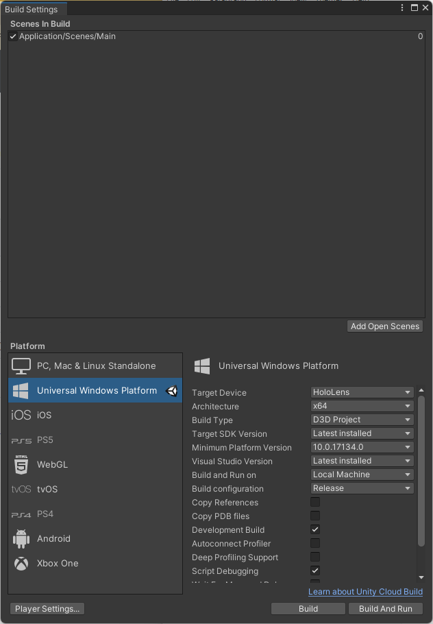
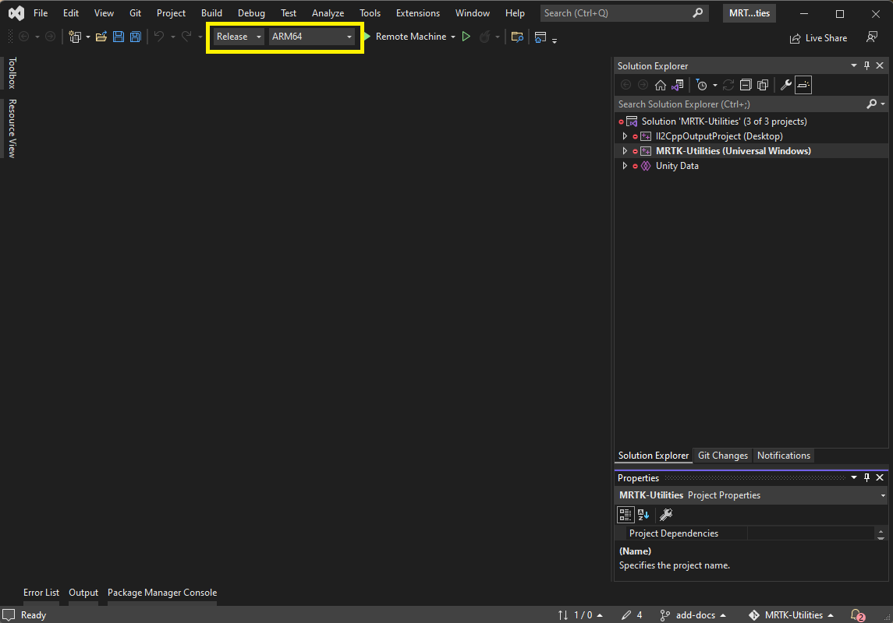
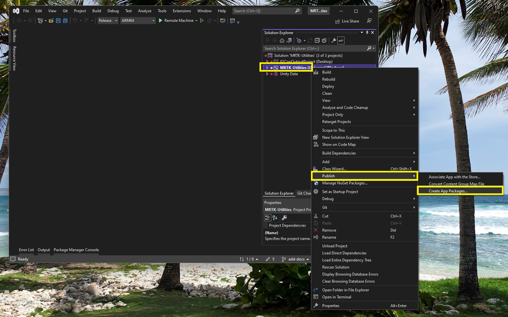

# Creating the App Package to publish

This document describes the *manual process* of creating the Application Package for deploying it to a HoloLens.

As an overview, the steps to follow are:

1. Clone the repository, open HoloLens application in Unity and configure the settings.
2. From the Build Settings build the Visual Studio solution.
3. Open the Visual Studio solution.
4. Create the application package from Visual Studio using a wizard.
5. Install the package on a HoloLens.

Below a detailed description of the steps can be found.

## Step 1: clone the repository, open the HoloLens Application in Unity

Let's start at the complete start of the process: cloning the repo. Make sure you selected **Universal Windows Platform** as platform in **Build Settings**.

## Step 2: Build the Visual Studio solution from Unity

On the **Build Settings** dialog click the **Build** button to build the Visual Studio solution. If this is the first time you're doing this, a folder picker dialog pops up in the project folder. Best practice is to create a sub-folder called **build** and select it.

> [!NOTE]
>
> The **[Bb]uild** and **[Bb]uilds** folders are in .gitignore, so they will never end up in the repo.

Once the build process is finished successfully a Windows Explorer will be opened for the generated solution in the build folder.

## Step 3: Open the generated solution in Visual Studio

Double click the solution file to open Visual Studio. Now it's important to select the appropriate configuration and architecture.

The configuration has actually 2 choices you should choose from:

* **Release** - is a version best used during development strangely enough.
* **Master** - is a version used for test and production.

The architecture for HoloLens 2 is always **ARM64**.

## Step 4: Create the App Package

As applications on HoloLens are deployed using the Universal Windows Platform (UWP) packaging mechanism, you need to create an app package. To do this in Visual Studio, right-click the project tagged **(Universal Windows)**, select **Publish** and then **Create App Package...**. This will start a wizard.

Going through the wizard, you'll see these following screens.

### Select distribution method

Here you can select to create a package to deploy to the *Microsoft Store* or use *Sideloading*. Select **Sideloading**. For more information on side loading, please read [Sideload LOB apps in Windows client OS - Windows Application Management | Microsoft Docs](https://docs.microsoft.com/en-us/windows/application-management/sideload-apps-in-windows-10)

> [!INFORMATION]
>
> ### Automatic Updates
>
> In this walkthrough we'll also explain the option **Enable automatic updates**. But extra setup is required and we'll point to documents explaining this.
>
> Using the automatic updates you have to publish the created package with all it's files to a location that's accessible from the HoloLens. This could be a file share or a website. You publish newer versions of the package to that same location. In the root of the created package is an APPINSTALLER file. You install the package on the device from this file. The APPINSTALLER file contains the latest version (and physical location) of the application. When the app starts on the HoloLens, the app will check this file if a newer version of the app is available. If it is, it will be downloaded and installed in the background. The next time you start the app, you have the newest version.
>
> For more information on using this feature and setting up a website on Azure for it, have a look at [Distribute a Windows 10 app from an Azure web app - MSIX | Microsoft Docs](https://docs.microsoft.com/en-us/windows/msix/app-installer/web-install-azure)
>
> **SUGGESTION:** If you just want to build a simple package, clear this flag.

You might see the dialog with a warning:

In this case you still have the Target Platform Minimum Version set to the default **10.0.10240.0** (which is actually the version of the first public Windows 10 release). It's necessary to set this to a higher version when you want to use the automatic update mechanism for sideloading. This can be done in the **Build Settings** in Unity to use the same version every time. But you can also change this in Visual Studio. To do this:

1. In Visual Studio, right click the project that is marked with (Universal Windows) and click **Properties**.
2. In the Properties dialog set the **Target Platform Min. Version** value to the same as the **Target Platform Version**. In the sample below that would be 10.0.19041.0.
   
3. Once this is done, click **OK** to save the settings and close the dialog. You can now restart Step 4.

Click **Next** to go to the next step.

### Select signing method

This step is about signing the package. More information about options to sign the package can be found in the documents [Sign an app package using SignTool - MSIX | Microsoft Docs](https://docs.microsoft.com/nl-nl/windows/msix/package/sign-app-package-using-signtool) and [Create a certificate for package signing - MSIX | Microsoft Docs](https://docs.microsoft.com/nl-nl/windows/msix/package/create-certificate-package-signing).

If you're okay with using the development certificate, keep the defaults here.

> [!WARNING]
>
> Certificates have an expiration date. Also the developer test certificates. By default the expire after 1 year. When you try to build a package using an expired certificate you get errors and the package is not created. Check the expiration date of the certificate. You can re-create the certificate in Unity on the **Player Settings** page.

Click **Next**.

### Select and configure packages

In this step there are a few important parameters to select and set up.

The **Output location** is the place on your local disk where the package is created.

The **Version** must be a new (higher) one every time you create another package if you want HoloLens to understand that a new package must be installed, either automatic or just by providing the package through the device portal. By default the version is set the first time to 1.0.0.0. The checkbox **Automatically increment** is checked by default to increase the patch number automatically.

> [!NOTE]
>
> As the complete Visual Studio solution is generated from Unity, as we have done in Step 1, this version is always set to 1.0.0.0 the first time you do this on your PC. All builds after that will update the Visual Studio solution and the version will be increment with each publish.
>
> Make sure to check if you're create a package with the desired version, which should be higher than the previous build on a HoloLens device.

The architecture provided in the package must be selected as well. Only select **ARM64** for a HoloLens 2 app package. The configuration should be **Release** or **Master** as explained before. If you want to be able to do crash analysis using stack traces and such, you should check **Include public symbol files**, but you can run the application without them of course.

If you didn't select *Automatic updates* in the *Sideloading* step, the only option you have now is to click **Create**. If you have *Automatic updates* selected, click **Next**.

### Configure update settings [Optional for Automatic Updates]

If you have *Automatic updates* selected in the *Sideloading* step, you'll see the step below. This is to configure the location where the package will be provided (file share or website).

> [!NOTE]
>
> This process will not publish to the indicated installer location, but will add this location in the APPINSTALLER file to make it known to the devices using this way to deploy the app. This means that you have to determine the location upfront and **do not change this later**. If you have to change this for some reason, you have to redeploy the app on devices manually with an older version of the app to get them to update automatically again.

You can determine how often the app on a device checks for a newer version. Choices are **Every time the application runs** or you can indicate a schedule, for instance every 7 days.

Click **Create** to create the package.

### Finished

Once the compile, package and publish process is finished the last page is showed.

> [!INFORMATION]
>
> This package process can be a time consuming one, depending on the size of the application and the power of the used machine. So, expect this to take some time.

You have published the package so you can click **Close** to close the dialog.

## Step 5: Installing the package on a HoloLens

There are multiple ways to setup deployment of the packages to a HoloLens. For all the options see the document [Overview - App Management | Microsoft Docs](https://docs.microsoft.com/en-us/hololens/app-deploy-overview).

The simplest way to deploy the package is using the App Installer on HoloLens. See [How to side load and Install Apps via HoloLens 2 App Installer | Microsoft Docs](https://docs.microsoft.com/en-us/hololens/app-deploy-app-installer) for more information.

> [!NOTE]
>
> The App Installer is not available if your device is considered "managed". See the documentation mentioned above for more information

The next simplest way to deploy the package is through the Windows Device Portal of the HoloLens. For the steps to follow here, see [Using the Windows Device Portal - Mixed Reality | Microsoft Docs](https://docs.microsoft.com/en-us/windows/mixed-reality/develop/advanced-concepts/using-the-windows-device-portal). The first time you want to deploy the package to a new HoloLens you have to setup the security certificate first before you can install the application package. This is all described in the mentioned documentation.

## Conclusion

We've tried to described all the possibilities here to make you aware of them. If you're publishing a package during development frequently, the steps start to be mostly next-next-finish. Just make sure that for the phase the project is in, you have determined the best way for deployment. This is especially important for production, where MDM, Microsoft Store for Business or Provisioning Packages might be the best options.
