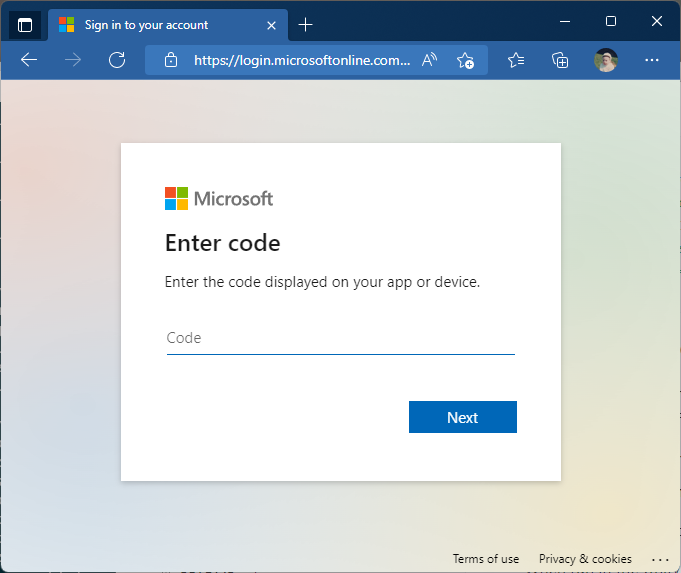
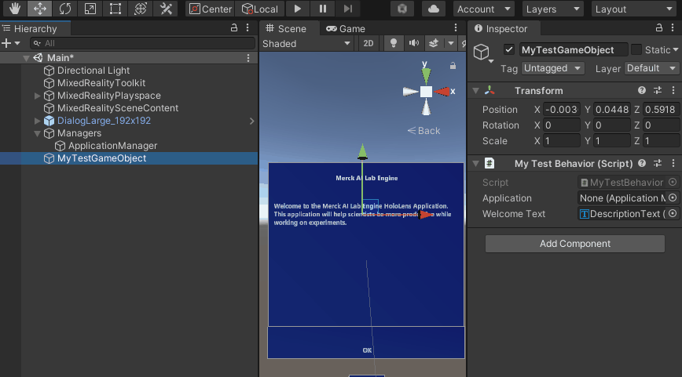

# Use Authentication in the HoloLens Application

The HoloLens Application uses the identity of the logged in user and will authenticate against the configured Azure AD App Registrations. If this is successful, an access token is acquired that is used to communicate with the Backend Web API and the underlying SharePoint environment.

This document describes how to configure the HoloLens Application, how the authorization is implemented and how to use it against the Backend Web API.

## Configure the HoloLens Application

The HoloLens Application uses the **appsettings.json** file in **Assets\StreamingAssets\Resources**. For more information on this file and how to use it, see [Configure the HoloLens Application](configure.md).

## Authentication in the HoloLens Application

The `main` scene has an `ApplicationManager` game object. That game object contains the `Application Manager (script)`. In the `Start` method of that script the initialization is done:

* the necessary secrets are loaded from **appsettings.json**.
* the authentication is done and an access token is acquired. Also the username is retrieved.

The authentication is done using [the Microsoft Authentication Library (MSAL)](https://docs.microsoft.com/en-us/azure/active-directory/develop/msal-overview).

When run in the Unity Editor the device code flow is initiated. This will open up a web browser on the device login page where you have to paste in the code shown in the message.



This code is automatically added to your clipboard by the Application Manager. Just paste it in. Next you can login with the user you want to use. Once the page tells you you're done and can close that page, the code retrieves the access token to be used.

When run in the HoloLens we use the account of the logged in user. We retrieve an access token for that user. This is all done without any UI.

## Use the Access token for accessing the Backend API

Let's say you have your own game object in the scene that contains your logic in a C# script. First you need to access the `ApplicationManager`. That can be done by adding this property to your script:

```csharp
    [Tooltip("Main Application manager.")]
    public ApplicationManager Application;
```

In Unity drag the `ApplicationManager` game object on the Application



In your code you need to make sure that the property has been set and use it. For instance:

```csharp
public async void TestWebApi()
{
    if (Application == null)
    {
        Debug.LogError("ERROR: Application property is not set!");
    }

    string token = await Application.GetAccessTokenAsync();

    using HttpClient client = new HttpClient();

    client.DefaultRequestHeaders.Accept.Clear();
    client.DefaultRequestHeaders.Authorization =
        new AuthenticationHeaderValue("Bearer", token);
   ...
}
```

## IMPORTANT: Don't cache the token yourself

It might be tempting to cache the token yourself as it is a string. But an access token from the Azure AD has a standard expiration time of 1 hour. The MSAL Library takes care of refreshing the token in the local cache. To make use of that, make sure to always call `GetAccessTokenAsync` whenever you need the token. Then you know it's always a token that's not expired.
